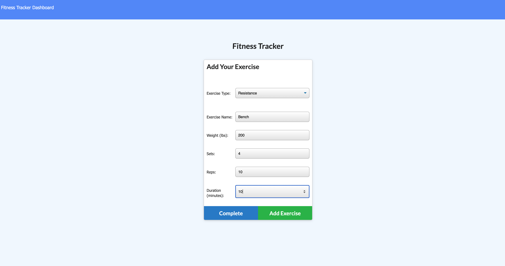
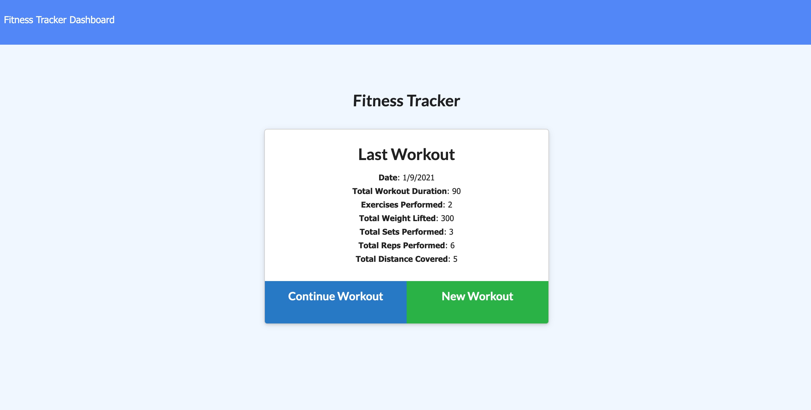
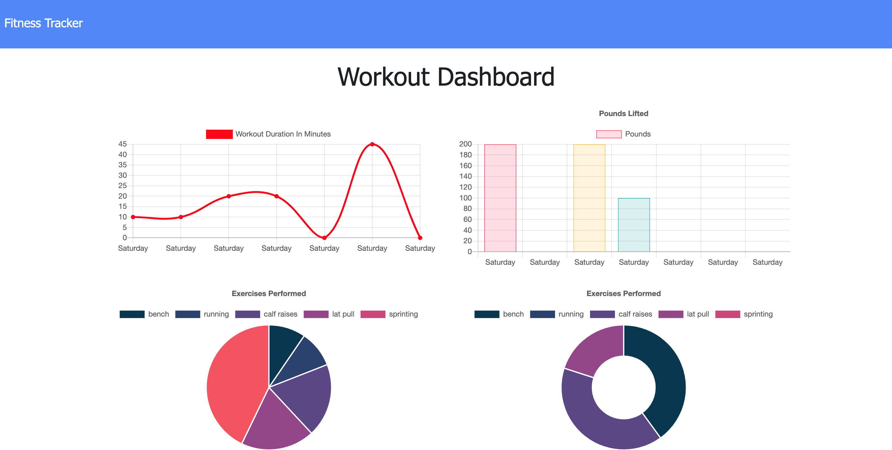

# workout-tracker

## Description

With the help of the workout tracker the user is able to create exercises and track all workouts with charts and graphs. This project uses the Mongo database with Mongoose schema.

## Table of Contents
- [Screenshot](#Screenshot)
- [Technology Concepts](#Technology-Concepts)
- [License](#License)

## Screenshot

## Technology Concepts

* MongoDB
* Mongoose
* Express

## License
[MIT](https://choosealicense.com/licenses/mit/#) License